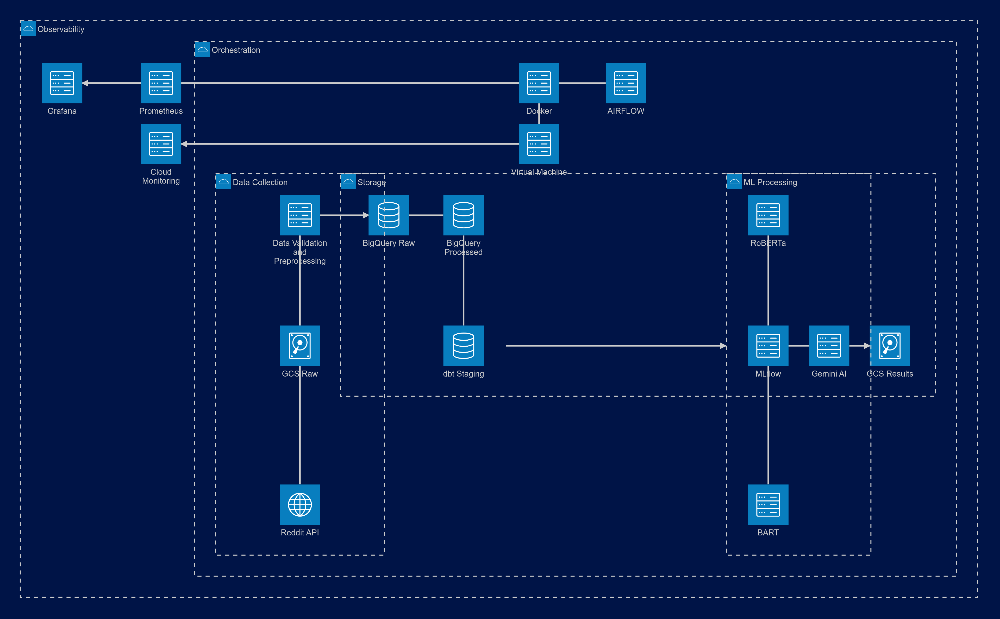

# Reddit Text Insight & Sentiment Analysis Pipeline - Cloud Implementation

A comprehensive data engineering pipeline for collecting, processing, and analyzing Reddit content using modern cloud data stack and LLMs, optimized for minimal cost.

## Overview

This project implements an end-to-end cloud data pipeline that:
- Collects data from Reddit API (posts and comments)
- Processes and transforms data using BigQuery and Apache Spark
- Performs text summarization using BART
- Analyzes sentiment using RoBERTa
- Generates insights using Google's Gemini
- Provides monitoring through Prometheus & Grafana
- Automates VM lifecycle for cost optimization

## Project Structure
```plaintext
Cloud/
├── airflow_project/           # Airflow configuration
│   ├── dags/                 # Pipeline DAG definitions
│   │   ├── reddit_pipeline_dag.py    # Main pipeline DAG
│   │   └── scripts/                  # Task scripts
│   │   
│   ├── plugins/              # Custom plugins
│   │   ├── logging_utils.py         # Logging utilities
│   │   └── metrics/                 # Metric collectors
│   └── logs/                # Airflow logs
│
├── credentials/             # Service account keys and credentials
│   └── service-account.json # GCP service account key
│
├── dbt_reddit_summary_cloud/ # DBT transformations
│   ├── models/              # DBT models
│   │   ├── staging/        # Staging models
│   │   └── processing/     # Processing models
│   ├── tests/              # Custom DBT tests
│   ├── macros/            # DBT macros
│   └── dbt_project.yml    # DBT configuration
│
├── docker/                   # Container configurations
│   ├── Dockerfile           # Main Airflow image
│   ├── build.sh             # Docker build script
│   └── docker-compose.yml   # Service orchestration
│
├── infrastructure/          # Cloud infrastructure
│   └── terraform/          # Infrastructure as Code
│       ├── core/           # Core infrastructure
│       │   ├── compute.tf  # VM configurations
│       │   └── variables.tf # Core variables
│       ├── iam/            # Identity and Access Management
│       │   ├── main.tf     # IAM bindings
│       │   └── service_accounts.tf # Service account definitions
│       ├── resource_scripts/ # Infrastructure scripts
│       │   ├── build_res.sh     # Main deployment script   
│       ├── vm_scripts/     # VM automation
│       │   ├── startup.sh  # VM startup script
│       │   └── shutdown.sh # VM shutdown script
│       └── main.tf         # Main Terraform configuration
│
├── results/                 # Pipeline output results
│   └── YYYY/MM/DD/         # Daily results structure
│
└── scripts/                 # Utility scripts
    ├── push_to_github.py   # GitHub sync utility
    ├── summarize.py        # Text summarization
    ├── sentiment_analysis.py # Sentiment analysis
    └── gemini_analyzer.py  # Gemini analysis
```

## System Architecture: Cost-Optimized Cloud Design

Our pipeline is designed with modularity and scalability in mind, comprising six main layers. Below is a high-level overview of how the components interact:


The diagram above illustrates the flow of data through our system, from collection to presentation. Each layer has specific responsibilities and communicates with adjacent layers through well-defined interfaces.


### 1. Data Collection Layer
- **Reddit API Integration**:
    - Fetch posts and comments from AI-focused subreddits
    - Store raw data in GCS buckets
- **Text Preprocessing**:
    - Clean and standardize text data
    - Prepare for ML processing
- **BigQuery Integration**: 
    - Load data into staging tables
    - Manage processing state
    - Incremental processing

### 2. Storage Layer
- **Google Cloud Storage (GCS)**:
    - Raw data storage
    - ML model artifacts
    - Daily results
- **BigQuery**:
    - Structured data storage
    - Efficient query processing
    - Cost-optimized table partitioning
- **DBT Transformations**:
   -  Stage posts and comments for further processing.
   -  Clean and standardize data structures.
   -  Manage processing state for each pipeline run.
   -  Automate cleanup upon pipeline completion.

### 3. Processing Layer
- **Text Summarization**: BART for concise summaries
- **Sentiment Analysis**: RoBERTa model
- **Insight Generation**: Google's Gemini AI
- **MLflow Integration**: Track experiments and models

### 4. Orchestration Layer
- **Single VM Deployment**:
    - e2-standard-2 instance
    - Docker container orchestration
    - Automated start/stop
- **Airflow DAGs**:
    - Main pipeline workflow
    - GitHub sync automation
    - Metric collection

### 5. Observability Layer
- **Cloud Monitoring**:
    - VM health checks
    - Cost monitoring
    - Alert policies
- **Local Monitoring**:
    - Prometheus metrics
    - Grafana dashboards
    - StatsD integration

### 6. Cost Management Layer
- **VM Lifecycle**:
    - Scheduled start/stop
    - Preemptible instances
    - Resource optimization


## Getting Started

### Prerequisites

1. **Google Cloud Platform (GCP) Setup**
   - Create a Google Account
   - Create a new project
   - Enable required APIs:
      ```bash
      gcloud services enable cloudresourcemanager.googleapis.com \
                           cloudbuild.googleapis.com \
                           cloudfunctions.googleapis.com \
                           cloudscheduler.googleapis.com \
                           cloudasset.googleapis.com \
                           artifactregistry.googleapis.com \
                           iam.googleapis.com \
                           compute.googleapis.com \
                           bigquery.googleapis.com \
                           storage.googleapis.com \
                           networkmanagement.googleapis.com
      ```

2. **Local Development Environment**
   - Install Google Cloud SDK
   - Install Terraform
   - Install Docker and Docker Compose
   - Install Git
   - Install jq (for json parsing)

### Initial Setup

1. **Clone the Repository**
   ```bash
   git clone https://github.com/SulmanK/reddit_ai_pulse_cloud_public.git
   cd reddit_ai_pulse_cloud_public/Cloud
   ```

2. **Configure GCP Authentication**
   ```bash
   gcloud auth login
   gcloud config set project YOUR_PROJECT_ID
   ```

3. **Environment Configuration**
   ```bash
   cp .env.example .env
   # Edit .env with your configurations
   ```

### Infrastructure Deployment

1. **Initialize Infrastructure**
   ```bash
   cd infrastructure/terraform
   ./build_res.sh
   ```
2. **Github Actions**
   - **upload-secrets.yml:** This GitHub Actions workflow is responsible for securely uploading secrets to Google Cloud Storage (GCS). It is triggered manually or when secrets are updated, ensuring that the latest secrets are available for the Airflow pipeline.

3. **Verify startup_script is complete**
   ```bash
   gcloud compute ssh airflow-reddit --zone=us-central1-a --command="sudo journalctl -u google-startup-scripts.service"
   ```


### Pipeline Operation
1. **Start Pipeline**
   ```bash
   cd vm_scripts
   ./start_dag.sh
   ```

2. **View the services on your local machine**
   ```bash
   gcloud compute ssh airflow@airflow-reddit   --zone=us-central1-a   --project=reddit-ai-pulse   -- -L 8080:localhost:8080   -L 5000:localhost:5000   -L 3000:localhost:3000   -L 9090:localhost:9090
   ```
    - Airflow: http://localhost:8080 (admin/admin)
    - MLflow: http://localhost:5000
    - Prometheus: http://localhost:9090
    - Grafana: http://localhost:3000 (admin/admin)


3. **View Results**
   Check GCS bucket for results
   ```bash
   gsutil ls gs://bucket/results
   ```

4. **Monitor Pipeline**
   - Check Airflow logs for task status
   - Monitor metrics in Grafana dashboards
   - Track ML experiments in MLflow

5. **Check the website**
    - [Website](https://reddit-ai-pulse.vercel.app/)
    - [Blog](https://sulmank.github.io/Blog/writing/2025/01/23/Reddit%20AI%20Pulse%20%28Cloud%29/)

### DBT Data Transformations

The project uses DBT (Data Build Tool) for transforming data in BigQuery, with the following key models:

1. **Staging Models**
   - `current_summary_staging`: View for staging daily summaries pending processing
   - Sources from raw Reddit data tables in BigQuery
   - Implements data validation and quality checks

2. **Processing Models**
   - `joined_summary_analysis`: Combines summaries with sentiment analysis
   - `update_processing_status`: Manages processing state of comments
   - Implements incremental processing for efficiency

3. **Data Tests**
   - Column presence and null checks
   - Value range validations
   - String quality checks
   - Custom tests for summary quality

4. **Model Configuration**
   ```yaml
   models:
     dbt_reddit_summary_cloud:
       materialized: table
       current_summary_staging:
         materialized: view
       joined_summary_analysis:
         materialized: table
       update_processing_status:
         materialized: incremental
   ```

5. **Running DBT**
   ```bash
   # Run all models
   dbt run

   # Run tests
   dbt test

   # Generate documentation
   dbt docs generate
   dbt docs serve
   ```


### Cleanup

```bash
# Destroy infrastructure
cd infrastructure/terraform
./cleanup.sh
```

## Tech Stack

- **Cloud Platform**: Google Cloud Platform
- **Infrastructure**: Terraform
- **Containers**: Docker, Docker Compose
- **Orchestration**: Apache Airflow
- **Storage**: Google Cloud Storage, BigQuery
- **Data Processing**: Apache Spark, dbt Core
- **ML Models**: BART (Summarization), RoBERTa (Sentiment), Gemini (Insights)
- **Monitoring**: Cloud Monitoring, Prometheus, Grafana
- **ML Tracking**: MLflow

## License

MIT License

